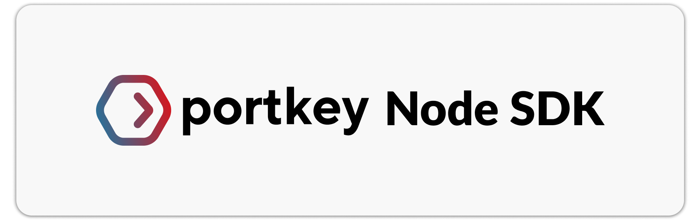

<div align="center">
<br />

## Build reliable, secure, and production-ready AI apps easily.

</div>

## **💡 Features**

**🚪 AI Gateway:**
*  Unified API Signature: If you've used OpenAI, you already know how to use Portkey with any other provider.
*  Interoperability: Write once, run with any provider. Switch between _any model_ from _any provider_ seamlessly. 
*  Automated Fallbacks & Retries: Ensure your application remains functional even if a primary service fails.
*  Load Balancing: Efficiently distribute incoming requests among multiple models.
*  Semantic Caching: Reduce costs and latency by intelligently caching results.

**🔬 Observability:**
*  Logging: Keep track of all requests for monitoring and debugging.
*  Requests Tracing: Understand the journey of each request for optimization.
*  Custom Tags: Segment and categorize requests for better insights.


## **🚀 Quick Start**

**4️ Steps to Integrate the SDK**
1. Get your Portkey API key and your virtual key for AI providers.
2. Construct your LLM, add Portkey features, provider features, and prompt.
3. Construct the Portkey client and set your usage mode.
4. Now call Portkey regularly like you would call your OpenAI constructor.

Let's dive in! If you are an advanced user and want to directly jump to various full-fledged examples, [click here](https://github.com/Portkey-AI/portkey-node-sdk/blob/main/examples).

---

### **Step 1️ : Get your Portkey API Key and your Virtual Keys for AI providers**

**Portkey API Key:** Log into [Portkey here](https://app.portkey.ai/), then click on the profile icon on top left and “Copy API Key”.
```bash
export PORTKEY_API_KEY="PORTKEY_API_KEY"
```
**Virtual Keys:** Navigate to the "Virtual Keys" page on [Portkey](https://app.portkey.ai/) and hit the "Add Key" button. Choose your AI provider and assign a unique name to your key. Your virtual key is ready!

### **Step 2️ : Construct your LLM, add Portkey features, provider features, and prompt**

**Portkey Features**:
You can find a comprehensive [list of Portkey features here](#📔-list-of-portkey-features). This includes settings for caching, retries, metadata, and more.

**Provider Features**:
Portkey is designed to be flexible. All the features you're familiar with from your LLM provider, like `top_p`, `top_k`, and `temperature`, can be used seamlessly. Check out the [complete list of provider features here](https://github.com/Portkey-AI/portkey-python-sdk/blob/af0814ebf4f1961b5dfed438918fe68b26ef5f1e/portkey/api_resources/utils.py#L137).

**Setting the Prompt Input**:
This param lets you override any prompt that is passed during the completion call - set a model-specific prompt here to optimise the model performance. You can set the input in two ways. For models like Claude and GPT3, use `prompt` = `(str)`, and for models like GPT3.5 & GPT4, use `messages` = `[array]`.

Here's how you can combine everything:

```javascript
import { Portkey } from "portkey-ai";

// Portkey Config
const portkey = new Portkey({
    mode: "single",
    llms: [{
        provider: "openai",
        virtual_key: "<>",
        model: "gpt-3.5-turbo",
        max_tokens: 2000,
        temperature: 0,
        // ** more params can be added here.
    }]
})

```

### **Steo 3️ : Construct the Portkey Client**

Portkey client's config takes 3 params: `api_key`, `mode`, `llms`.

* `api_key`: You can set your Portkey API key here or with `bash script` as done above.
* `mode`: There are **3** modes - Single, Fallback, Loadbalance.
  * **Single** - This is the standard mode. Use it if you do not want Fallback OR Loadbalance features.
  * **Fallback** - Set this mode if you want to enable the Fallback feature.
  * **Loadbalance** - Set this mode if you want to enable the Loadbalance feature. 
* `llms`: This is an array where we pass our LLMs constructed using the LLMOptions interface.

### **Step 4️ : Let's Call the Portkey Client!**

The Portkey client can do `ChatCompletions` and `Completions`.

Since our LLM is GPT4, we will use ChatCompletions:

```javascript
async function main() {
    const response = await portkey.chatCompletions.create({
        messages: [{
            "role": "user",
            "content": "Who are you ?"
        }]
    })
    console.log(response.choices[0].message)
}

main().catch((err) => {
    console.error(err);
    process.exit(1);
});
```

You have integrated Portkey's Node SDK in just 4 steps!

---


## **📔 Full List of Portkey Config**

| Feature             | Config Key              | Value(Type)                                      | Required    |
|---------------------|-------------------------|--------------------------------------------------|-------------|
| Provider Name       | `provider`        | `string`                                         | ✅ Required  |
| Model Name        | `model`        | `string`                                         | ✅ Required |
| Virtual Key OR API Key        | `virtual_key` or `api_key`        | `string`                                         | ✅ Required (can be set externally) |
| Cache Type          | `cache_status`          | `simple`, `semantic`                             | ❔ Optional |
| Force Cache Refresh | `cache_force_refresh`   | `True`, `False` (Boolean)                                 | ❔ Optional |
| Cache Age           | `cache_age`             | `integer` (in seconds)                           | ❔ Optional |
| Trace ID            | `trace_id`              | `string`                                         | ❔ Optional |
| Retries         | `retry`           | `integer` [0,5]                                  | ❔ Optional |
| Metadata            | `metadata`              | `json object` [More info](https://docs.portkey.ai/key-features/custom-metadata)          | ❔ Optional |

## **🤝 Supported Providers**

|| Provider  | Support Status  | Supported Endpoints |
|---|---|---|---|
| | OpenAI | ✅ Supported  | `/completion`, `/embed` |
| | Azure OpenAI | ✅ Supported  | `/completion`, `/embed` |
| | Anthropic  | ✅ Supported  | `/complete` |
| | Cohere  | 🚧 Coming Soon  | `generate`, `embed` |


---

#### [📝 Full Documentation](https://docs.portkey.ai/) | [🛠️ Integration Requests](https://github.com/Portkey-AI/portkey-node-sdk/issues) | 

<a href="https://twitter.com/intent/follow?screen_name=portkeyai"></a>
<a href="https://discord.gg/sDk9JaNfK8" target="_blank"></a>
